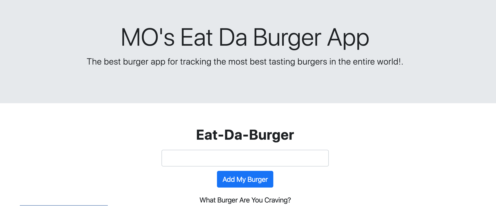

# Eat-Da-Burger

## Description
Mo's Eat-Da-Burger app is a restaurant app that lets users input the names of burgers they'ed like to eat.

When ever a user submits a burger's name, this app will display the burger on the left side of the page - waiting to be devoured

Each burger in the waiting area also has a Devour it! button.

## Technology Used
* My SQL, Node, Express, Handlebars, and Homemade ORM, as well Heroku

## Future Development (Ice Box)
Continue adding more functionality and features to the burger app.  Currently this app is barebones and it requires a lot more functionality to become a useful tool.  For instance I am having some issues connecting to mySQL and giving the user the ability to see thier input when entered
